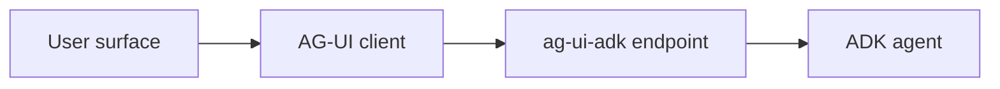

# Frontends

  Runtime guide

Use this section when you have an ADK agent and want to put it behind an
application UI. ADK owns agent execution, sessions, tools, and events. The
frontend layer adds a stable client contract for chat, generative UI, browser
tools, mobile surfaces, and messaging platforms on top of that runtime.

ADK Web is the development UI for testing agents. For an application you ship
to users, you connect your own frontend to the agent through a protocol the
frontend can consume. The pages in this section document that path with
[AG-UI](https://docs.ag-ui.com/), an open, event-based protocol for
agent-to-user interaction that ADK supports through the `ag-ui-adk` package.

## Architecture

The frontend path has three parts:

1. Your ADK agent runs in Python, the same way it runs under `adk web` or
   `adk api_server`.
2. The `ag-ui-adk` middleware exposes that agent as an AG-UI endpoint. It
   translates ADK events into AG-UI events and turns tool results from the
   frontend back into ADK function responses.
3. An AG-UI client renders the event stream and sends user input, tool
   results, and state back to the endpoint.

The [API server](../api-server.md) also streams events over `/run_sse`, and
that stream is the right tool for scripts and tests. AG-UI adds a
client-facing contract on top: typed events for text, tool calls, and shared
state, a defined way for the frontend to return tool results, and client SDKs
that implement the protocol. Frontend code should consume AG-UI rather than
parse ADK's runtime events directly.

## Choose a client

Any client that speaks AG-UI can drive an ADK agent:

| Client | Use it for |
|---|---|
| [CopilotKit](/integrations/copilotkit/) | React, Angular, Vue, and React Native applications, plus Slack. Packaged chat components, frontend tools, generative UI, and human-in-the-loop hooks. |
| Community SDKs | AG-UI clients for [Kotlin](https://github.com/ag-ui-protocol/ag-ui/tree/main/sdks/community/kotlin), [Java](https://github.com/ag-ui-protocol/ag-ui/tree/main/sdks/community/java), and [Go](https://github.com/ag-ui-protocol/ag-ui/tree/main/sdks/community/go/example/client), and a [TypeScript CLI example](https://github.com/ag-ui-protocol/ag-ui/tree/main/apps/client-cli-example/src). |
| Your own client | Any HTTP client that posts a run and reads the event stream. The [AG-UI client SDK](https://docs.ag-ui.com/sdk/js/client/overview) handles the protocol details. |

The client-side examples in this section use CopilotKit. The backend setup is
the same for every client.

## Implementation path

1. Build and debug the agent in [ADK Web](../web-interface/index.md).
2. Add the [AG-UI endpoint](ag-ui/index.md) with `ag-ui-adk`.
3. Connect the client for the surface you are building.
4. Add generative UI or interaction patterns only when the user experience
   needs them.

Keep credentials, session lookup, authorization, and tool execution policy on
the backend side of the AG-UI boundary. Keep rendering, local interaction
state, client tools, and user approval UI in the frontend.
